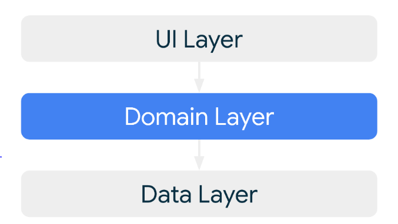

# PostsApp

## Description
The PostsApp is a mobile application that displays Two Screens Posts List that shows title and supports paging in offline/online mode and Post Details screen that shows title and image.

## Libraries Used

- [Retrofit](https://github.com/square/retrofit)
- [Hilt](https://github.com/google/dagger) for Dependency Injection
- [Jetpack Compose](https://developer.android.com/compose)
- [GSON](https://github.com/google/gson)

## Design and Architecture

1- The app follows a Domain-Driven Design (DDD) approach, with clear separation of concerns:
- **Domain**: Contains use cases that encapsulate the business logic of the app. The use cases are responsible for fetching data from the repository and providing it to the ViewModel.
- **Data**: Contains service interfaces for accessing external APIs and DataSource Repository implementation.
- **UI**: Contains the UI layer, including Jetpack Compose screens and ViewModels.

  

2- **Dependency Injection**: Hilt is used to manage dependencies across the app. This ensures that components like ViewModels, Repositories, and API services are provided and managed efficiently

3- **Asynchronous Operations**: Coroutines and Flow are used to handle asynchronous operations, such as network requests and data fetching. This ensures that the app remains responsive and can handle data streams efficiently.

4- **Error Handling**: The app implements comprehensive error handling using Kotlin coroutines, exception handling mechanisms, and UI states to ensure a robust user experience.
Error Handling with Exceptions and Coroutines
Try-Catch Blocks: All network requests are wrapped in try-catch blocks to catch exceptions such as IOException and HttpException.
Coroutine Exception Handler: A custom CoroutineExceptionHandler is used to handle uncaught exceptions in coroutines, logging errors and updating the UI state accordingly.

## Run the App
- you may need to have new API key  from this website [Rapid API](https://rapidapi.com/bonaipowered/api/news-api14/playground/apiendpoint_8ef933e7-215e-4a0f-bc5f-f85bebd24f34) and update Constant file here with this key.

`  const val HEADER_API_VALUE = "5f54f520a7mshb9494b680d2bfbdp159cd4jsnfbdc10e50ef3"`
## TODO
- Add Unit Testing
- Add code Coverage